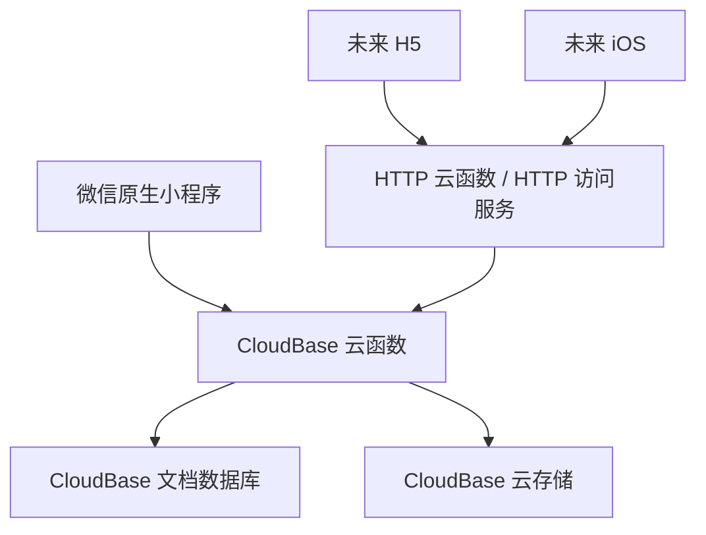

# CloudBase 原生重构技术设计

## 设计目标

本设计目标是将项目重构为 CloudBase 原生小程序，并为未来 H5 和 iOS 保留稳定后端能力。

设计优先级：

1. 现场使用稳定。
2. 微信小程序体验原生。
3. 核心业务状态机在云端一致。
4. 数据模型可被 H5/iOS 复用。
5. UI 规范统一，可持续扩展。

## 总体架构



小程序主链路使用 `wx.cloud.callFunction`。H5 和 iOS 未来通过 HTTP 云函数访问同一套业务动作。

## 目录结构

```text
ImprovTool/
├── wechat-app/
│   ├── project.config.json
│   ├── miniprogram/
│   │   ├── app.js
│   │   ├── app.json
│   │   ├── app.wxss
│   │   ├── pages/
│   │   ├── components/
│   │   ├── services/
│   │   ├── styles/
│   │   └── utils/
│   ├── cloudfunctions/
│   │   ├── trainer-api/
│   │   ├── live-api/
│   │   ├── participant-api/
│   │   ├── review-api/
│   │   └── _shared/
│   └── tests/
│       └── unit/
└── docs/
    └── archive/
        └── cloudbase-rebuild/
```

当前 Python 后端已从生产目标中移除。旧跨端前端实现已从根目录移除，历史用途记录在 `docs/archive/legacy-implementation-inventory.md`。微信开发者工具只需要导入 `wechat-app/`，生产目标代码位于 `wechat-app/miniprogram/` 和 `wechat-app/cloudfunctions/`。

## 技术栈

### 小程序端

- 微信原生小程序。
- JavaScript。
- WXML/WXSS。
- `wx.cloud`。
- `miniprogram-ci`。

### 云函数端

- Node.js。
- JavaScript。
- CloudBase 云函数。
- `wx-server-sdk`。
- shared validators。

### 未来 H5

- Vue 3 或 React。
- Vite。
- `@cloudbase/js-sdk`。
- CloudBase Web Auth。
- CloudBase 静态托管。

### 未来 iOS

- 优先 Flutter。
- 通过 HTTP 云函数/HTTP API 接入。
- 统一 `userId`，不直接依赖小程序 `openid`。

## 领域模型

### User

```ts
interface User {
  id: string
  openid?: string
  unionid?: string
  webUid?: string
  phone?: string
  createdAt: number
  updatedAt: number
}
```

### TrainerProfile

```ts
interface TrainerProfile {
  id: string
  userId: string
  displayName: string
  role: 'trainer'
  organization?: string
  createdAt: number
  updatedAt: number
}
```

### Template

```ts
interface Template {
  id: string
  ownerId: string
  name: string
  type: PlanType
  participantCount: number
  customerName?: string
  phases: Phase[]
  favorite: boolean
  createdAt: number
  updatedAt: number
}
```

模板不是方案，不包含方案状态。

### Plan

```ts
type PlanStatus = 'draft' | 'confirmed' | 'delivered' | 'reviewed'

interface Plan {
  id: string
  ownerId: string
  templateId?: string
  name: string
  type: PlanType
  status: PlanStatus
  participantCount: number
  customerName?: string
  phases: Phase[]
  favorite: boolean
  pinned: boolean
  createdAt: number
  updatedAt: number
}
```

### LiveSession

```ts
type LiveSessionStatus = 'running' | 'ended' | 'reviewed'

interface LiveSession {
  id: string
  ownerId: string
  planId: string
  planSnapshot: PlanSnapshot
  status: LiveSessionStatus
  currentPhaseIndex: number
  allowRepeatPick: boolean
  startedAt: number
  endedAt?: number
}
```

### Participant

```ts
interface Participant {
  id: string
  sessionId: string
  openid: string
  name: string
  groupId?: string
  checkedInAt: number
}
```

### Group

```ts
interface Group {
  id: string
  sessionId: string
  groupNo: number
  name: string
  color: string
  memberIds: string[]
  score: number
  updatedAt: number
}
```

### ScoreEvent

```ts
interface ScoreEvent {
  id: string
  sessionId: string
  groupId: string
  delta: number
  reason?: string
  createdAt: number
}
```

## 数据集合和索引

| 集合 | 关键索引 | 说明 |
| --- | --- | --- |
| `users` | `openid`, `webUid`, `phone` | 多端身份映射 |
| `trainer_profiles` | `userId` | 培训师资料 |
| `templates` | `ownerId + updatedAt` | 个人模板 |
| `plans` | `ownerId + status + updatedAt` | 方案列表 |
| `plans` | `ownerId + favorite + updatedAt` | 收藏方案 |
| `activities` | `ownerId + scene + difficulty + updatedAt` | 活动库 |
| `live_sessions` | `ownerId + status + startedAt` | 培训记录 |
| `participants` | `sessionId + name` | 防重名 |
| `participants` | `sessionId + openid` | 防重复签到 |
| `groups` | `sessionId + groupNo` | 分组结果 |
| `score_events` | `sessionId + groupId + createdAt` | 积分流水 |
| `feedback` | `sessionId + createdAt` | 反馈 |
| `reviews` | `sessionId + ownerId` | 复盘 |
| `notes` | `sessionId + phaseId + updatedAt` | 笔记 |

唯一语义由云函数写入前校验和事务/幂等保护共同保证。

## 云函数设计

### 统一调用格式

小程序调用：

```ts
wx.cloud.callFunction({
  name: 'live-api',
  data: {
    action: 'checkin',
    requestId: 'client-generated-id',
    payload: {}
  }
})
```

统一响应：

```ts
interface ApiResponse<T> {
  code: number
  message: string
  data?: T
  requestId?: string
}
```

错误码：

- `0`：成功
- `40001`：参数错误
- `40101`：未识别身份
- `40301`：无权限
- `40401`：资源不存在
- `40901`：重复提交或状态冲突
- `50001`：服务异常

### trainer-api

动作：

- `getHomeSummary`
- `getProfile`
- `updateProfile`
- `listPlans`
- `createPlan`
- `updatePlan`
- `confirmPlan`
- `deletePlan`
- `listTemplates`
- `applyTemplate`
- `saveAsTemplate`
- `listActivities`
- `createActivity`
- `updateActivity`
- `deleteActivity`

### live-api

动作：

- `startSession`
- `getSession`
- `nextPhase`
- `prevPhase`
- `manualCheckin`
- `listParticipants`
- `generateGroups`
- `confirmGroups`
- `addScore`
- `pickParticipant`
- `saveNote`
- `endSession`

### participant-api

动作：

- `getSessionPublicInfo`
- `checkin`
- `submitFeedback`
- `submitInteraction`

参与者端动作必须通过 `sessionId + sceneCode` 或短期口令校验，避免裸露任意写入。

### review-api

动作：

- `listReviews`
- `getReviewDetail`
- `startReview`
- `saveReview`
- `completeReview`

## 小程序页面设计

### 页面结构

- `pages/home/index`
- `pages/prepare/index`
- `pages/prepare/plan-list`
- `pages/prepare/template-list`
- `pages/plan/edit`
- `pages/plan/preview`
- `pages/activity/list`
- `pages/activity/edit`
- `pages/live/index`
- `pages/live/end`
- `pages/participant/checkin`
- `pages/participant/feedback`
- `pages/review/list`
- `pages/review/detail`
- `pages/mine/index`
- `pages/mine/settings`

### 通用组件

- `NavBar`
- `HalfSheet`
- `Toast`
- `ConfirmDialog`
- `SearchBar`
- `FilterBar`
- `SwipeAction`
- `ToolGrid`
- `ToolButton`
- `BottomActionBar`
- `EmptyState`
- `LoadingState`

### 视觉规则

- 子页面返回按钮与内容卡片左边界对齐。
- 图标统一放在文字左侧，工具宫格除外。
- 现场工具宫格使用双列布局。
- 底部按钮不使用过扁长样式，宽度与内容和容器关系保持统一。
- 所有提示文案短、明确、可执行。
- 加载超过 600ms 显示 loading，超过 3s 给出“网络较慢，请稍候”。

## 身份与权限

### 小程序

- 云函数通过 `cloud.getWXContext()` 获取 `OPENID`。
- `OPENID` 映射到内部 `userId`。
- `ownerId` 是所有培训师资源的权限边界。
- 参与者提交通过 `sessionId + sceneCode` 校验，不获取培训师权限。

### H5

- 使用 CloudBase Web Auth。
- 登录后映射到同一 `userId`。
- H5 只访问 HTTP 云函数，不直接复用小程序 `OPENID`。

### iOS

- 使用 HTTP 云函数和 CloudBase Auth/自有登录态。
- 与 `users.webUid`、`phone` 或未来 `appleUserId` 绑定。

## 弱网与幂等

所有关键写入必须携带 `requestId`：

- `startSession`
- `checkin`
- `generateGroups`
- `confirmGroups`
- `addScore`
- `pickParticipant`
- `endSession`
- `saveReview`

云函数保存 `operation_logs`：

```ts
interface OperationLog {
  requestId: string
  action: string
  actorId: string
  targetId: string
  result: unknown
  createdAt: number
}
```

重复请求返回第一次结果，不重复写入业务集合。

## 迁移策略

不兼容旧数据。当前产品为新开发产品，允许清空或忽略旧结构。

迁移方式：

1. 旧跨端前端仅保留历史清单说明，旧 `backend/` 已移除。
2. 新建 `wechat-app/miniprogram/`、`wechat-app/cloudfunctions/`。
3. 优先迁移核心业务模型和主链路。
4. 主链路可用后再删除或归档旧实现。

## 测试策略

### 云函数

- 领域函数单元测试。
- 数据访问层测试。
- 幂等和权限测试。
- 现场主链路集成测试。

### 小程序

- 真机多尺寸测试。
- 弱网测试。
- 页面交互走查。
- 微信开发者工具预览。

### 发布检查

- CloudBase dev/prod 环境分离。
- 集合和索引创建完成。
- 安全规则配置完成。
- 云函数日志和基础告警可用。
- 小程序隐私协议、用户协议、类目、合法域名配置完成。
