# 培训师工具箱小程序功能、交互与数据链路核对

> 历史文档：保留旧审计过程，当前正式实现请以 `wechat-app/` 目录、`docs/archive/cloudbase-rebuild/` 和 `docs/release-checklist.md` 为准。

日期：2026-05-26

更新：2026-05-29，已按 CloudBase 原生小程序目录 `wechat-app/miniprogram` 重新复查。

补充更新：2026-05-29 晚间，继续按旧版 `frontend` 的页面结构和交互逻辑，对 CloudBase 原生小程序补齐新建方案、新建活动、活动详情、现场分组/积分、培训结束后续动作和“我的”页子页面。

## 0. CloudBase 原生实现复查结论

本次复查对象为 `wechat-app/miniprogram` 和 `wechat-app/cloudfunctions`。旧 `frontend` 只作为交互与视觉参照，不再作为当前运行代码。

已对齐：

- 首页：保留旧版问候、日期、开课卡片、复盘卡片、待处理列表；点击“我要开课”进入半弹窗，支持“从我的方案”和模板选择。
- 首页模板：流程模板已按旧版恢复为 4 个，包含企业培训、团建活动、即兴演出、即兴训练。
- 首页待处理：点击“方案待开课”直接进入备课的我的方案，并筛选已确认方案；点击“草稿方案”筛选草稿。
- 备课：恢复“我的方案/活动库”和开课场景下“我的方案/个人模板”的分流；已确认方案可开始，模板可应用为草稿，草稿可进入编辑。
- 新建方案：恢复先选模板再进入方案编辑，方案编辑包含名称、人数、客户、方案类型、环节设置、预览、确认方案和开始培训；保存草稿/确认方案已接入 `trainer-api`。
- 活动库：恢复新增活动表单、活动详情、收藏、编辑、添加到方案的半弹窗路径；活动新增/编辑/删除已接入 `trainer-api`。
- 我的：恢复资料卡、统计卡、培训记录、数据详情、设置、帮助与反馈、关于等入口；资料修改只通过资料卡右侧编辑按钮弹出半弹窗，不再占据页面主体。
- 现场：恢复旧版深色现场页结构，包含返回、当前环节、进度条、主计时器、关键提醒、上一环节、下一环节和结束培训。
- 工具：现场底部只保留高频工具；其他工具统一收纳到“工具箱”半弹窗。签到、分组、积分、随机、互动、音效、计时、笔记均可打开；分组结果展示每组成员姓名，积分按已确认小组同步。
- 结束：补齐培训结束页，支持收集反馈、开始复盘、查看当前场次数据、返回首页；对应子页面已恢复为可操作页面。

数据流复查：

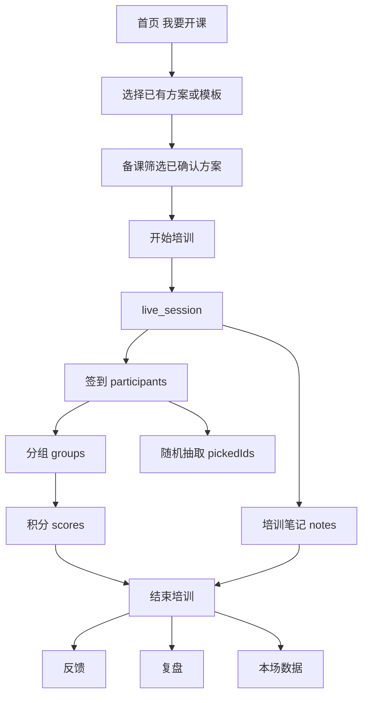

仍需在发布前继续补强：

- CloudBase 文档数据库需要初始化正式集合、索引和种子模板，当前前端在空库时会使用本地预览数据兜底。
- 方案编辑、活动编辑已接基础 CloudBase CRUD；复盘详情、数据详情已补页面承接，正式聚合统计和跨场次分析仍需继续接 CloudBase。
- 正式二维码图片仍待接入小程序码生成；内测阶段继续展示页面路径和口令。

## 1. 审查基准

本次审查以三个来源为基准：

- PRD：`培训师工具箱-产品需求文档-v1.0.docx`
- 工程说明：`README.md`
- 当前实现：`frontend/pages.json`、`frontend/pages/**`、`frontend/stores/**`、`backend/functions/**`

判断原则：

- 对现场高压操作，优先保证链路真实可用，再追求 PRD v3.0 的指令面板范式。
- 对已展示给用户的功能，不能只是静态假入口；若暂未实现，应明确标注未开放。
- 对二级页视觉，返回按钮、页面卡片、主要按钮需要使用统一边距和统一图标方向。

状态说明：

- 已完成：当前实现可用，且本轮已修复明显问题。
- 部分完成：有页面或部分接口，但缺少完整真实链路。
- 待实现：PRD 有要求，当前尚未落地。
- 产品取舍：当前实现与 PRD 不一致，但建议按当前方案推进，后续再升级。

## 2. 本轮逐项问题核对

| 编号 | 问题 | 检查结论 | 处理 |
| --- | --- | --- | --- |
| UI-01 | 所有子页面返回键要与下方卡片左边界对齐 | 原实现按微信胶囊安全区计算返回按钮，和页面内容 32rpx 边距不是同一套坐标 | 已把 `NavBar` 返回按钮左边距统一到页面内容边距 |
| UI-02 | 培训结束页按钮图标应在文字左侧 | `LiveEnd` 的图标容器没有声明横向排列，uvue 下可能纵向堆叠 | 已修复为横向 icon + text |
| UI-03 | 活动编辑删除按钮图标应在文字左侧 | 删除按钮内图标容器未声明横向排列 | 已修复为横向 icon + text |
| UI-04 | 反馈页标题类图标应在文字左侧 | `feedback-inline-icon` 未统一声明横向布局 | 已修复为横向 icon + text |
| UI-05 | 底部弹窗灰底、安全区异常 | `HalfSheet` 曾以 max-height 控制，短内容/长内容场景不稳定 | 已改为语义高度 + 固定底部对齐 |
| UI-06 | 页面主色不统一 | `uni.scss` 为蓝色，`styles/variables.scss` 仍是旧橙色 | 已统一为蓝色主品牌 token |
| UI-07 | 工具箱按钮图标和文字偏左 | 双列改造后图标与文字曾横向靠左，视觉不够稳定 | 已改为双列居中按钮，图标和名称都在卡片中居中 |
| UI-08 | 工具弹层底部按钮过长或靠右 | 现场工具内 `结束签到/保存笔记/重置积分` 等按钮样式不统一 | 已按复盘详情页按钮比例统一为居中、自适应宽度，并继续保留安全区避让 |
| UI-09 | 新增活动页与其他二级页不一致 | 原表单直接铺在灰底上，按钮为大胶囊样式 | 已统一为二级页卡片表单、统一输入框、统一短按钮 |
| PRD-01 | PRD v3.0 要求指令面板替代工具栏 | 当前现场页仍保留显式工具栏 | 产品取舍：先保留显式工具，保证现场可用；指令面板作为下一阶段增强 |
| PRD-02 | PRD 要求扫码签到/扫码反馈 | 当前已有参与者端签到/反馈页面和入口路径 | 部分完成，真实二维码图片待正式小程序码方案 |
| PRD-03 | PRD 要求方案导出 | 当前支持 Markdown 导出到剪贴板 | 内测采用 Markdown；正式版再评估 PDF/DOCX |

## 3. 功能清单

### 3.1 首页

页面：`frontend/pages/home/index.uvue`

- 问候与日期展示。
- 快速开课：选择流程模板，配置培训名称、人数、签到、分组、积分。
- 从我的方案开课：选择已确认方案进入现场。
- 我要复盘入口。
- 待处理任务/最近操作入口。

相关数据：

- `userStore`：用户昵称与统计。
- `planStore`：方案列表和待复盘数量。
- `liveStore`：快速开课后创建现场会话。

完整性判断：

- 快速开课和从方案开课路径已可进入现场。
- 首页指令面板是 PRD v3.0 能力，当前未实现，建议后置。

### 3.2 备课与方案

页面：

- `frontend/pages/prepare/index.uvue`
- `frontend/pages/plan/PlanEdit.uvue`
- `frontend/pages/plan/PlanPreview.uvue`

功能：

- 方案列表、搜索、筛选。
- 新建/编辑方案。
- 五段式或模板式流程配置。
- 方案确认。
- 已确认方案开课。
- 方案预览。
- 导出 Markdown 文档。
- 另存为个人模板。

相关接口：

- `/plan/create`
- `/plan/update/{planId}`
- `/plan/detail/{planId}`
- `/plan/list`
- `/plan/confirm/{planId}`
- `/plan/delete/{planId}`

数据链路：

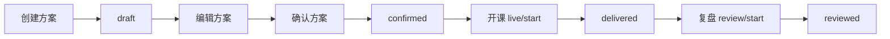

完整性判断：

- 方案核心状态链路完整。
- 方案预览已支持当前视角 Markdown 导出，内测阶段满足方案文档交付；正式 PDF/DOCX 仍后置。

### 3.3 活动库

页面：

- `frontend/pages/prepare/index.uvue`
- `frontend/pages/plan/ActivityDetail.uvue`
- `frontend/pages/plan/ActivityEdit.uvue`

功能：

- 活动列表、搜索、分类筛选。
- 活动详情。
- 收藏/取消收藏。
- 新建/编辑/删除活动。
- 将活动加入方案。

相关接口：

- `/activity/list`
- `/activity/detail/{activityId}`
- `/activity/create`
- `/activity/update/{activityId}`
- `/activity/delete/{activityId}`
- `/activity/favorite/{activityId}`

数据链路：

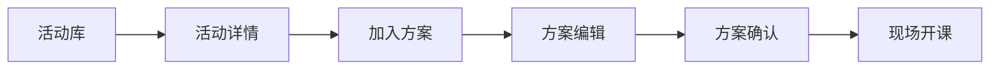

完整性判断：

- 活动管理和加入方案路径基本完整。
- 新增/编辑活动页已统一视觉，并会保存场景、难度、人数、时长、学习目标、规则、复盘问题和带领者 Tips。
- 活动详情的复盘引导内容可展示，但还没有自动生成现场 L1 规则摘要。

### 3.4 现场交付

页面：

- `frontend/pages/live/index.uvue`
- `frontend/pages/live/LiveEnd.uvue`

功能：

- 开始现场会话。
- 环节推进/回退。
- 主计时器、双击延时。
- 签到管理。
- 分组管理。
- 积分管理。
- 随机抽取。
- 互动工具入口。
- 音效工具入口。
- 现场笔记。
- 结束培训。

相关接口：

- `/live/start`
- `/live/checkin`
- `/live/checkin/list`
- `/live/group`
- `/live/score`
- `/live/pick`
- `/note/save`
- `/note/list`
- `/live/end`

现场核心数据链路：

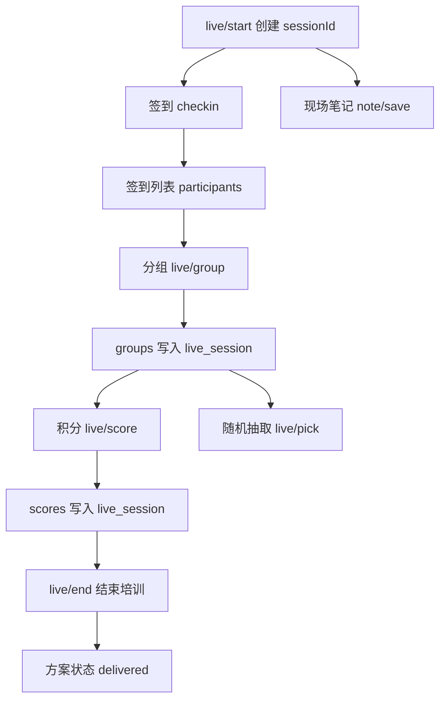

完整性判断：

- 签到 -> 分组 -> 积分 -> 结束这条核心现场链路已修通。
- 签到已补参与者端页面路径，真实二维码图片待正式小程序码方案接入。
- 互动工具已接入参与者提交与培训师端实时聚合。
- 音效工具已内置默认音频资源，播放失败时降级为震动提示。

### 3.5 反馈收集

页面：`frontend/pages/feedback/index.uvue`

功能：

- 展示反馈入口。
- 反馈数量、满意度、NPS、回收率统计。
- 匿名开关。
- 反馈列表。

相关接口：

- `/feedback/submit`
- `/feedback/stats`
- `/feedback/list`

数据链路：

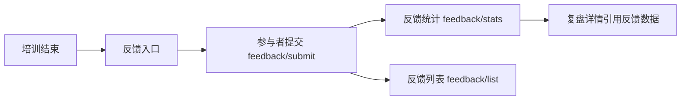

完整性判断：

- 后端反馈提交、统计、列表链路存在。
- 前端培训师侧统计展示存在。
- 参与者填写页面已补齐，真实二维码图片待正式小程序码方案接入。

### 3.6 复盘

页面：

- `frontend/pages/review/ReviewCenter.uvue`
- `frontend/pages/review/ReviewDetail.uvue`

功能：

- 待复盘/已复盘列表。
- 创建复盘。
- 查看反馈摘要。
- 填写复盘记录。
- 保存复盘。

相关接口：

- `/review/start`
- `/review/detail/{reviewId}`
- `/review/save/{reviewId}`
- `/review/list`

数据链路：

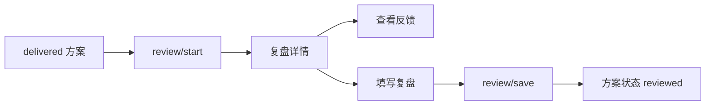

完整性判断：

- 复盘主链路存在。
- 自动报告生成、PDF/文档导出未实现。

### 3.7 我的与设置

页面：

- `frontend/pages/mine/index.uvue`
- `frontend/pages/mine/TrainingRecords.uvue`
- `frontend/pages/mine/DataDetail.uvue`
- `frontend/pages/mine/Settings.uvue`
- `frontend/pages/mine/HelpFeedback.uvue`
- `frontend/pages/mine/About.uvue`

功能：

- 用户资料展示和昵称编辑。
- 培训记录。
- 数据详情。
- 手势设置。
- 帮助与反馈。
- 关于、隐私说明、用户协议占位。

相关接口：

- `/user/profile`
- `/user/stats`
- `/user/feedback`

完整性判断：

- 用户资料编辑已保存到本地和接口。
- 手势设置覆盖左滑、右滑、双击延时。
- PRD v3.0 的摇一摇分组、长按加分、双指截图、手势教学未实现。

## 4. 用户操作路线核对

### 路线 A：快速开课

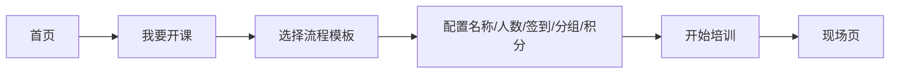

核对：

- 模板选择可用。
- 配置页可用。
- 可进入现场。
- 快速开课会自动创建并确认一个来源为 `quick_start` 的方案实例，后续复盘、数据统计和课后追溯都有正式方案上下文。

### 路线 B：从方案开课

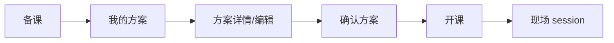

核对：

- 方案确认、开课可用。
- `planId` 会进入现场 session。
- 结束后可进入 delivered 状态。

### 路线 C：活动进入方案

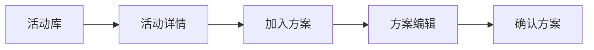

核对：

- 活动浏览、详情、收藏可用。
- 加入方案入口存在。
- 需要继续检查“加入已有方案/新建方案”的异常路径和空方案路径。

### 路线 D：现场签到 -> 分组 -> 积分

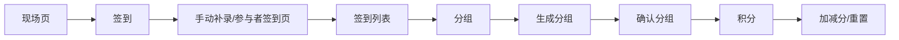

核对：

- 手动补录可用。
- 后端能返回真实签到列表。
- 分组基于已签到参与者。
- 积分写回队伍数据。
- 参与者签到页已可提交；正式二维码图片仍待接入小程序码。

### 路线 E：现场推进 -> 结束 -> 反馈/复盘

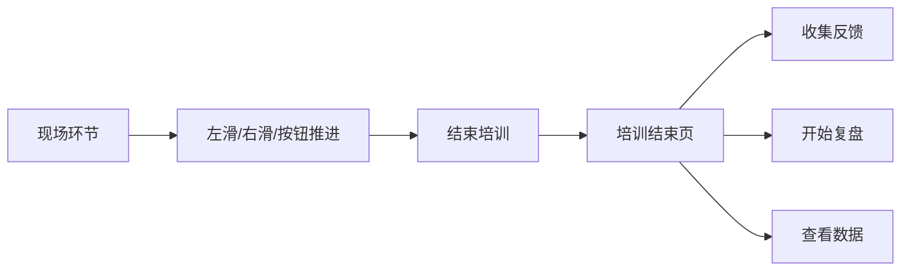

核对：

- 环节推进、回退、结束可用。
- 培训结束页按钮已调整图标方向。
- 反馈/复盘/数据入口存在。
- 参与者反馈页已可提交；正式二维码图片仍待接入小程序码。
- “查看数据”从培训结束页进入时携带当前 `sessionId`，只展示当前场次数据。

### 路线 F：反馈 -> 复盘沉淀

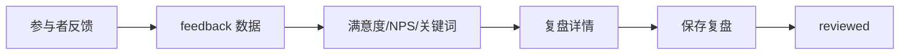

核对：

- 后端数据模型和接口存在。
- 培训师侧统计展示存在。
- 参与者侧提交入口需要补齐。

## 5. 关联功能分组

### 5.1 强数据链路

这些功能必须串起来，不能单独存在：

- 方案链路：活动 -> 方案 -> 确认 -> 开课 -> 结束 -> 复盘。
- 现场链路：sessionId -> 签到 -> 分组 -> 积分 -> 结束。
- 反馈链路：sessionId -> 反馈提交 -> 反馈统计 -> 复盘引用。
- 用户链路：登录 -> 资料 -> 统计 -> 我的页面。

### 5.2 弱关联功能

这些功能可以独立使用，但最好和主链路打通：

- 随机抽取：应优先从已签到参与者中抽取。
- 现场笔记：应绑定 sessionId 和当前环节。
- 音效工具：可以独立，但应受模板和现场阶段推荐。
- 设置：手势开关影响现场页交互。

### 5.3 当前不应伪装完成的功能

- 指令面板。
- 正式小程序码图片生成与 CDN 存储。
- 方案导出和培训报告导出。
- 扩展音效资源包和后台配置。
- v3.0 完整手势体系。

## 6. 产品建议

### 6.1 PRD 与当前实现不一致的取舍

建议采用“当前显式工具 + 后续指令面板增强”的路线。

原因：

- 现场培训中，签到、分组、积分属于高压高频操作，显式按钮更容易被新用户发现。
- 当前代码已经有显式工具栏基础，短期改成指令面板会扩大风险。
- 指令面板适合作为熟练用户效率增强，而不是当前 MVP 的唯一入口。

推荐阶段：

1. 当前阶段：保证显式工具真实可用。
2. 下一阶段：增加指令面板，但保留底部工具入口。
3. 数据稳定后：根据使用频率逐步减少常驻工具。

### 6.2 真实闭环优先级

优先级从高到低：

1. 正式小程序码图片生成与入口分享。
2. 复盘详情引用真实反馈数据并形成报告。
3. 方案/报告导出。
4. 指令面板。
5. 扩展音效资源包和后台配置。

## 7. 验收清单

### 7.1 视觉验收

- 二级页返回按钮左边界与页面卡片左边界一致。
- 主要按钮中的图标在文字左侧。
- 按钮文字和图标垂直居中。
- 页面卡片左右边距统一为 32rpx，特殊页面必须说明原因。
- 底部弹窗打开后不露灰底，不遮挡 iPhone 底部安全区。

### 7.2 现场链路验收

- 创建现场 session 后能获取 sessionId。
- 手动签到 3 人后，签到列表显示 3 人。
- 生成 2 组后，分组结果写入后端。
- 给第 1 组加 1 分，重新打开积分弹窗仍显示 1 分。
- 重置积分后，所有组分数为 0。
- 结束培训后，进入培训结束页，并可进入反馈/复盘。

### 7.3 反馈复盘验收

- 反馈接口拒绝非法 sessionId。
- 反馈接口拒绝非法 rating/NPS。
- 反馈统计只允许读取当前用户自己的 session。
- 复盘保存后方案状态进入 reviewed。

### 7.4 微信设备验收

至少检查：

- iPhone SE 宽度。
- iPhone 390px x 844px。
- 大屏 iPhone。
- 微信开发者工具胶囊位置。
- 底部安全区。

## 8. 工具可用性逐项核对

| 工具 | 入口 | 当前可用能力 | 仍需确认/增强 |
| --- | --- | --- | --- |
| 签到 | 现场页快捷工具、工具箱 | 手动补录、参与者端签到页、真实签到列表、签到人数统计 | 正式二维码图片生成 |
| 分组 | 现场页快捷工具、工具箱 | 基于已签到人员自动分组，结果写回 session | 已确认不开放参与者自选队伍；只保留均分/随机自动分组 |
| 积分 | 现场页快捷工具、工具箱 | 按队伍加减分、重置分数，分数写回 session | 详细积分规则是否需要分项打分 |
| 随机 | 现场页/工具箱 | 从已签到人员随机抽取；默认排除本轮已抽中过的人，可切换允许重复抽取；题目池本地抽取 | 后续可增加按组抽取 |
| 互动 | 工具箱 | 词云/投票/承诺已生成参与者入口，参与者端可提交，培训师端轮询统计；同时支持培训师手动补录 | 正式二维码图片生成方式需确认 appid/secret/CDN |
| 音效 | 现场页/工具箱 | 内置少量通用默认 WAV 音效，播放失败时降级为震动和提示反馈 | 后续如扩展音频包，需确认来源和授权 |
| 计时 | 现场页/工具箱 | 主计时、独立正计时/倒计时、双击延时 | 是否需要后台运行和结束铃声 |
| 笔记 | 工具箱 | 按 session 和环节保存现场笔记 | 是否需要自动带入复盘报告 |

## 9. 全部可能数据链路

### 9.1 登录与身份链路

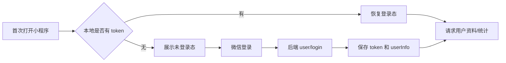

未登录展示规则：

- 首页展示登录提示卡，不主动拉取方案列表，避免 401 打扰用户。
- 备课页展示登录空态，登录后再加载方案和活动库。
- 我的页展示“未登录”，统计为 0，培训记录/数据详情需要登录后查看。

### 9.2 首页快速开课链路

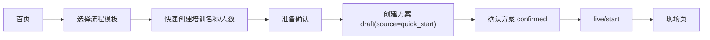

产品规则：

- “流程模板”是系统级流程蓝图，只表达默认环节、工具组合和推荐结构。
- “方案”是某一次培训可编辑、可确认、可交付、可复盘的数据实例。
- 快速开课从模板生成方案实例，并标记 `source=quick_start`、`templateId`、`templateName`、`isTemplateInstance=true`。
- 课后默认保留为正式方案实例，便于统计和复盘追溯；不自动回写为模板，避免一次现场临时调整污染系统模板。
- 备课列表展示“快速开课”或“模板生成”来源标识，用户能区分普通手工方案和模板实例。

### 9.3 方案编辑与预览链路

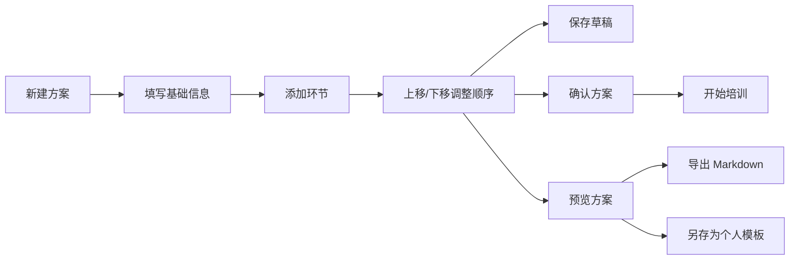

布局规则：

- “预览”属于导航右侧次要操作，应放在标题右侧、微信胶囊左侧。
- 标题必须保持居中并截断，不能被右侧操作覆盖。
- 环节排序使用上/下箭头，不使用左右箭头，避免误解为进入详情或横向切换。

培训师/客户视角差异：

- 培训师视角面向现场执行，展示时间控制、控场提醒、工具使用和复盘线索。
- 客户视角面向售前或交付沟通，展示课程价值、议程、参与体验和交付节奏，不展示内部控场提示。
- 当前导出会跟随当前视角生成 Markdown 文档。

### 9.4 活动库到方案链路

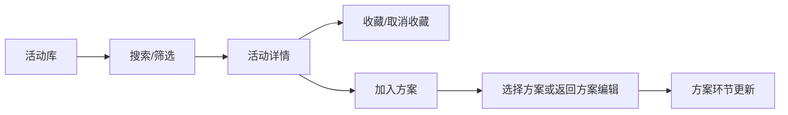

### 9.5 现场执行链路

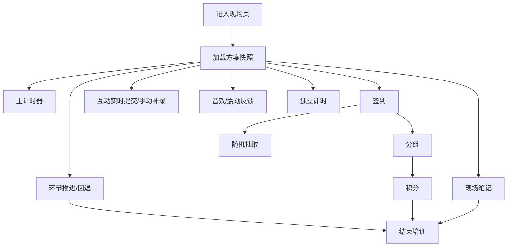

现场关键链路检查：

- 签到到分组到积分：参与者先进入 `participants`，同一场次禁止重名和重复签到；分组工具只基于已签到人员生成 `groups`，分组结果同时保存成员 ID、姓名和成员摘要，积分按 `groupId` 写回 session，链路闭合。
- 签到到随机抽取：随机抽取只从已签到人员中选择；默认携带已抽中 ID 列表排除重复，用户可切换“允许重复抽取”。
- 分组约束：不提供参与者自选队伍入口；现场只提供培训师触发的均分/随机分组。
- 互动提交：培训师创建互动后生成参与入口，参与者进入 `InteractionSubmit` 提交，后端写入 `interactions.submissions/options`，培训师端定时拉取统计。
- 网络延迟：请求 3.5 秒未返回时提示“网络较慢，请稍候”，15 秒超时后按超时/后端不可达/微信 localhost 调试问题区分提示。

### 9.6 互动扫码实时提交链路

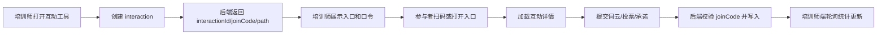

二维码生成建议：

- 当前实现先返回小程序页面路径和口令，保证参与者端真实可提交。
- 内测期先展示小程序页面路径和口令，保证真实提交链路可用。
- 正式发布建议由后端使用微信小程序码能力生成图片，scene 中只放短参数，例如 `interactionId` 和 `joinCode`，再把图片存储到对象存储/CDN 返回 `qrImageUrl`。
- 不建议前端本地拼接长期二维码图片作为唯一方案，因为小程序码需要 appid/secret 并且要控制参数长度、过期策略和权限校验。

### 9.7 现场结束后链路

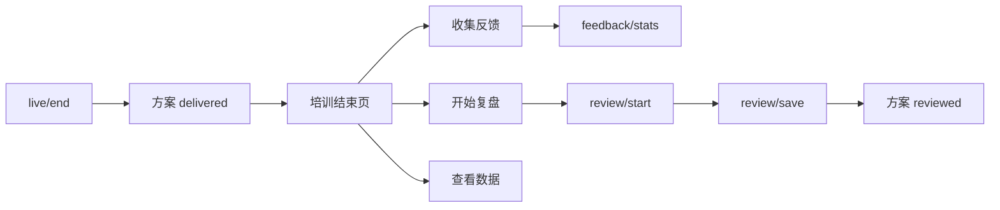

### 9.8 异常与网络链路

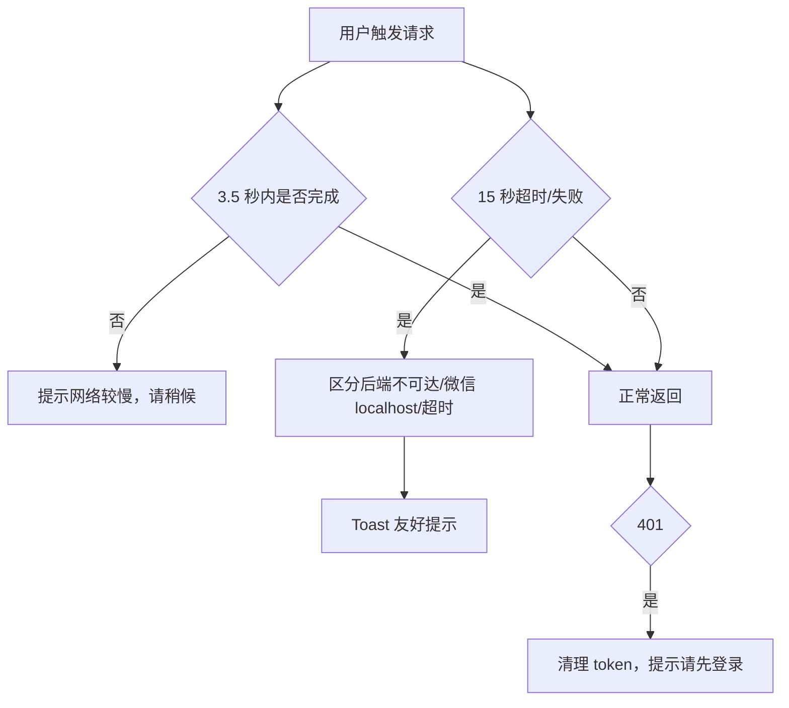

## 10. 微信小程序专项注意事项

### 10.1 登录与授权

- 微信登录不等于用户授权头像昵称；当前应先做静默登录拿 token，再让用户在“我的”中编辑昵称。
- 首次打开没有 token 时，不能立刻刷一堆 401；页面要显示未登录空态。
- token 失效后要清理本地登录态，并提示重新登录。

### 10.2 网络与域名

- 微信开发者工具不能直接请求 `localhost`，应使用局域网 IP。
- 正式版必须配置合法 request 域名。
- 请求需要超时和慢网提示，不能让按钮点击后无反馈。

### 10.3 安全区与胶囊

- 所有自定义导航都要避让微信胶囊。
- 返回按钮与页面内容左边界统一对齐。
- 底部固定按钮必须考虑 `safe-area-inset-bottom`。

### 10.4 小程序包体与资源

- 图标优先使用 `AppIcon + icons.uts` 映射，微信端使用 png 兜底。
- 微信小程序不能直接调用一套通用“手机自带音效库”；可以使用震动、系统交互反馈，以及小程序自己的音频资源。
- 网上下载音效必须确认授权，不能把来源不明的音频放入正式包。
- 当前已内置少量通用默认音效作为兜底；更完整的音频包建议走 CDN/云存储或后台配置，便于替换、压缩和控制包体。

### 10.5 生命周期

- 从后台回到前台时，现场计时器和 session 状态需要考虑恢复。
- 网络中断时，现场关键操作要给出明确失败提示，不应静默丢失。

## 11. 已确认结论与仍需确认项

已按产品结论实现：

1. 互动工具走参与者扫码/入口实时提交，同时保留培训师手动补录。
2. 自由分组不允许参与者自选队伍，前端不再提供该选项。
3. 随机抽取支持配置是否重复抽取，默认不重复，允许用户切换。
4. 快速开课生成正式方案实例，并用来源标识区分“快速开课/模板生成/手工方案”。
5. 内测期二维码先展示页面路径和口令，正式小程序码图片后续实现。
6. 方案预览支持 Markdown 导出，并支持另存为个人模板。
7. 扩展音效内测阶段不走 CDN/后台配置，继续使用包内默认音效。

仍需确认：

1. 正式二维码图片后续是否统一由后端生成并存储到 CDN。
2. 如需替换或扩展音效资源，是否提供有授权的正式音频包。

## 12. 发布上线差距评估（产品专家视角）

### 12.1 可以进入内测的基础

- 方案从草稿、确认、开课、交付到复盘的主状态链路已经打通。
- 现场 `sessionId` 数据链路已经覆盖签到、分组、积分、随机抽取、笔记、结束、反馈和本场数据。
- 首页未登录态、备课未登录态、我的页登录态已具备基本提示，不会首次打开就暴露无意义错误。
- 现场工具优先保留显式入口，适合内测阶段培训师快速理解和操作。
- 内测期二维码以页面路径和口令替代正式小程序码，能保证真实提交链路可测。

### 12.2 发布前必须补齐

- 正式小程序码图片生成：签到、反馈、互动都需要后端生成小程序码，避免真实用户复制页面路径。
- 合法域名、appid、登录授权、隐私协议、用户协议和小程序后台配置需要完整走通。
- 关键接口的慢网、超时、401、权限错误提示需要在真机弱网下验收。
- 数据权限需要重点复查：反馈、复盘、活动、方案、现场会话都必须只能读写当前用户数据。
- 真实设备视觉验收至少覆盖 iPhone SE、390x844、Pro Max、安卓常见尺寸和微信开发者工具。

### 12.3 建议后置到 v1.1

- PDF/DOCX 正式导出和培训报告排版。
- 指令面板、摇一摇分组、长按加分、双指截图等高级手势。
- 扩展音效资源包、CDN/后台配置和授权音频替换。
- 随机题库后台配置、按队伍/按角色抽取、多人批量抽取。
- 自动生成复盘报告和客户版交付报告。
