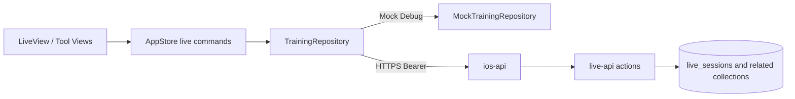

# iOS 现场全链路与跨端布局收敛 Design

## 1. 设计目标

本设计将 iOS 现场页从“本地聚合对象整体保存”调整为“服务端细分 action 驱动的场次状态”，并让 iPhone、iPad 复用同一业务状态和工具组件。实现以现有小程序与 `live-api` 为事实基线，不新建第二套业务语义。

成功标准：

- 开课、恢复、现场写入、结束形成可追踪的真实请求链路。
- 同一场次的写操作有确定顺序，失败可见且不会被旧响应覆盖。
- 环节计时使用目标环节而非旧闭包状态。
- iPhone 与 iPad 只改变容器布局，不复制业务逻辑。
- Debug Mock 可离线验证，Release 仍严格禁止回退 Mock。

## 2. 总体架构



职责边界：

- View 只负责展示、输入和本地计时/音效，不直接构造 CloudBase 请求。
- `AppStore` 负责单场次命令编排、加载状态、错误状态和本地乐观更新回滚。
- Repository 负责 action 名、DTO、响应映射和 HTTP 错误，不承载 UI 规则。
- `ios-api` 继续负责 iOS 身份校验与 action 转发。
- `live-api` 继续作为现场业务和数据库写入的唯一服务端入口。

## 3. 数据模型

### 3.1 Domain 模型

在现有 `TrainingSession` 聚合中补充现场恢复所需的结构化字段：

- `Participant`：增加可选 `checkedInAt`。
- `TrainingGroup`：增加服务端 `groupId` 映射和可选颜色；成员继续保存参与者 ID。
- `ScoreEntry`：队伍、增减值、原因、创建时间。
- `LiveRandomState`：随机页签、允许重复、已抽 ID、当前结果和历史。
- `LiveNote`：服务端 ID、环节、内容、创建时间。
- `LiveEntryCode`：小程序码临时地址、页面路径、可复制链接。
- `LiveInteractionStats`：参与人数、选项统计或词频结果。
- `TrainingSession`：增加 `isGrouped`、`teamCount`、`groupMethod`、`scoreMode`、`scoreDetails`、`randomState`；将字符串笔记升级为 `[LiveNote]`。

新增字段提供明确默认值，保持 Mock fixture 和现有测试的构造成本可控；不把 CloudBase 原始文档字段直接暴露给 View。

### 3.2 DTO 与映射

新增独立的现场 API DTO 文件，由 `CloudBaseTrainingRepository` 使用显式 `CodingKeys` 映射：

- `StartSessionResponseDTO.sessionId`
- `SessionDetailResponseDTO.session`
- `LiveSessionDTO`：映射 `_id`、`planSnapshot`、`currentPhaseIndex` 和各工具状态。
- `PlanSnapshotDTO`：将服务端 phase 的 `minutes` 映射为 Domain 的 `durationMinutes`。
- 各 action 的 request/response DTO：签到、分组、积分、随机、互动、笔记、结束。

Domain 不直接 `Decodable` 服务端原始文档。这样可以显式处理 `_id/id`、`groupId/id`、日期字符串和缺省字段，避免契约变化表现为半初始化页面。

## 4. Repository 契约

移除现场路径对通用 `saveSession` 的依赖，在现有 `TrainingRepository` 增加最小细分方法：

```swift
func startSession(planID: String) async throws -> TrainingSession
func loadLiveSession(sessionID: String) async throws -> TrainingSession
func loadParticipants(sessionID: String) async throws -> [Participant]
func manualCheckin(sessionID: String, name: String) async throws -> Participant
func loadSessionEntry(sessionID: String) async throws -> LiveEntryCode
func savePhase(sessionID: String, phaseIndex: Int) async throws -> Int
func saveGroups(sessionID: String, state: LiveGroupState) async throws -> LiveGroupState
func saveScores(sessionID: String, state: LiveScoreState) async throws -> LiveScoreState
func saveRandom(sessionID: String, state: LiveRandomState) async throws -> LiveRandomState
func loadInteractions(sessionID: String) async throws -> [LiveInteraction]
func createInteraction(sessionID: String, draft: LiveInteractionDraft) async throws -> LiveInteraction
func closeInteraction(sessionID: String, interactionID: String) async throws
func loadInteractionStats(sessionID: String, interactionID: String) async throws -> LiveInteractionStats
func loadInteractionEntry(sessionID: String, interactionID: String) async throws -> LiveEntryCode
func loadNotes(sessionID: String) async throws -> [LiveNote]
func saveNote(sessionID: String, phaseName: String, content: String) async throws -> LiveNote
func endSession(sessionID: String) async throws
```

`startSession` 在真实仓库内部按顺序执行：

1. `live.startSession` 获取 `sessionId`。
2. `live.getSessionDetail` 获取场次和方案快照。
3. 并行读取参与者、互动和笔记等互不依赖的数据。
4. 全部映射成功后才返回完整 `TrainingSession`。

Mock Repository 实现同一契约，并保存内存中的确定性状态，用于无网测试。旧 `saveSession` 在所有调用迁移后删除，避免继续误用不存在的 action。

## 5. AppStore 状态与写入顺序

`AppStore` 为现场能力提供显式 async 命令，而不是 `Task` 内 fire-and-forget：

- `startLiveSession`
- `restoreLiveSession`
- `changePhase`
- `manualCheckin`
- `confirmGroups`
- `updateScores`
- `updateRandomState`
- `create/close/loadInteraction`
- `saveLiveNote`
- `endLiveSession`

状态增加：

- `liveLoadState`：idle/loading/loaded/failed。
- `liveMutation`：当前 action 标识；同一场次写请求进行中时禁用冲突操作。
- `liveError`：可展示并可清除的用户错误。

写入规则：

- 同一类状态只允许一个在途写请求，按钮显示保存中。
- 分组、积分、随机和环节允许乐观展示，但必须保存旧快照；失败时回滚并保留重试入口。
- 服务端返回的标准化状态覆盖本地草稿，不以请求参数假定成功结果。
- 结束场次不做乐观跳转；必须等待 `live.endSession` 成功后再清除现场状态并刷新方案/记录。
- 不再由任意 `TrainingSession` 修改触发整体保存，避免乱序和假成功。

## 6. 环节与计时

环节切换提取为可测试的纯规则：

```text
目标 index -> 校验范围 -> 读取目标 phase -> 重置目标时长 -> 保存 phase index
```

- View 向 `changePhase(to:)` 传目标 index，不传旧 session 副本。
- 主计时器以目标 phase 的 `durationMinutes` 重建，并取消旧 timer。
- 保存失败时恢复旧 index 和旧计时快照。
- 滑动和前后按钮统一调用同一个命令。
- 完成提醒由本地一次性标记控制，重置或切换环节后才允许再次触发。

独立计时继续保存在现场页面级 `LiveToolState`，sheet 关闭不销毁；它不进入 CloudBase。

## 7. 服务端最小扩展

现有 action 已覆盖开课、签到、分组、积分、随机、互动、笔记写入和结束，仅新增两个 action：

### 7.1 `live.savePhaseState`

- 输入：`sessionId`、`currentPhaseIndex`。
- 校验：调用人拥有场次、场次为 running、index 为整数且在 `planSnapshot.phases` 范围内。
- 写入：更新 `currentPhaseIndex`、`updatedAt`。
- 输出：服务端最终 `currentPhaseIndex`。

### 7.2 `live.listNotes`

- 输入：`sessionId`。
- 校验：调用人拥有场次。
- 查询：`session_notes` 按创建时间倒序，限制 200 条。
- 输出：标准化的 `id`、`phaseName`、`content`、`createdAt`。

`ios-api` 的现有 `live.*` 通用转发路径应直接承载这两个 action；只有契约测试发现转发白名单限制时才做对应最小修改。服务端仍执行所有权和运行状态校验，不信任 iOS 传入身份。

## 8. UI 组件与布局

### 8.1 共享组件

拆分边界按可复用界面职责，而不是为每个小视图建抽象：

- `LiveHeader`：场次、环节、连接/保存状态。
- `LivePhaseTimerCard`：当前环节、主计时、提醒。
- `LiveQuickActions`：签到、分组、积分、工具箱。
- `LivePhaseNavigator`：上一环节、进度、下一环节。
- `LiveToolContent`：按工具 destination 渲染现有工具面板。
- 各工具只在内容复杂时保留独立 View；业务动作仍调用 AppStore。

### 8.2 iPhone

- 顶部状态和中心主计时保持首屏可见。
- 底部 `safeAreaInset` 固定高频工具与环节导航。
- 工具箱选择一个 destination 后打开单一 item-driven sheet。
- sheet 内删除当前无法切换的八项 segmented Picker；标题只表示当前工具。
- 工具主体使用 `ScrollView`/`LazyVStack`，关键保存按钮固定在底部安全区，避免空白 `List` 和按钮随内容滚走。

### 8.3 iPad

- 主内容与约 360pt 右侧 inspector 并列。
- inspector 可切换工具，但渲染同一个 `LiveToolContent`。
- 不建立第二份 tool state 或 session；横竖屏压缩时主区优先保证计时和环节导航可读。

### 8.4 视觉与可访问性

- 现场背景 `#1A1A2E`，内容面使用白色或 `#1C1E27`，品牌动作 `#4A7CF7`。
- 成功 `#34C759`、危险 `#E5484D` 只表达状态，不作为大面积装饰。
- 使用 Dynamic Type、语义字体和最小 44pt 点击区；计时数字允许缩放但不截断。
- 加载、空、失败、保存中均有明确文字和控件状态。

## 9. 音效

将项目小程序已有的欢呼、鼓掌、铃声和主题音频作为 iOS bundle resources 引入，不生成新内容。新增一个轻量 `LiveSoundPlayer` 使用 `AVAudioPlayer`：

- 同一时间只播放一个音效，新播放停止旧音效。
- 资源缺失或播放失败时触发对应触感并展示非阻断提示。
- 音效不写服务端，不请求额外权限。

## 10. 错误、安全与日志

- HTTP、业务错误和 DTO 解码错误统一转为可读 `RepositoryError`，同时保留 action 名用于本地诊断。
- 日志不得输出 Bearer token、小程序码临时地址完整查询参数或参与者敏感输入。
- Release 配置缺失继续返回配置错误，绝不实例化 Mock Repository。
- 退出 sheet 不清除未提交草稿；退出整个现场页前，若存在未提交写操作则阻止误退出或提示等待。

## 11. 测试设计

### 11.1 Swift 单元与契约测试

- 使用可注入 `URLSession`/URLProtocol stub 校验 action 名、payload 和 DTO 映射。
- 校验开课严格执行 `startSession -> getSessionDetail -> 并行附属读取`。
- 校验 `_id`、`planSnapshot.phases[].minutes`、`groupId` 和日期映射。
- 校验写入中禁用、成功采用服务端结果、失败回滚、结束失败不离场。
- 校验连续环节切换使用目标时长，不发生 15/45 分钟互换。
- Mock Repository 覆盖签到、分组、积分、随机、互动、笔记和结束的确定性行为。

### 11.2 云函数测试

- `savePhaseState`：所有权、状态、边界 index、成功写入。
- `listNotes`：所有权、排序、字段标准化和数量限制。
- 现有 live action 语法和契约回归。

### 11.3 构建与运行态校验

按阶段依次执行：

1. Swift package tests。
2. iPhone Simulator Debug 构建与开课、环节、八项工具、结束冒烟。
3. iPad Simulator Debug 构建与 inspector/共享状态冒烟。
4. 云函数语法检查和 `tooling/verification/npm run verify:all`。
5. `git diff --check` 与改动文件范围审查。

若缺少真实测试环境网关和令牌，最终只标记 Mock/契约/Simulator 验证完成，并把真实 CloudBase E2E 列为部署后验证，不能用 Mock 结果替代。

## 12. 实施顺序与回滚边界

实现按可独立验证的六个阶段推进：

1. Domain、DTO、Repository 契约与契约测试。
2. `live-api` 两个最小 action 与云函数测试。
3. AppStore 命令、顺序写入、错误和回滚测试。
4. 现场工具逐项接入真实 Repository。
5. iPhone/iPad 共享组件与布局收敛、音效资源。
6. 全量构建、运行态矩阵、回归与文档/任务记录。

每阶段通过对应测试后再进入下一阶段。若某阶段失败，只回退该阶段新增调用或组件，不通过恢复通用 `saveSession` 或 Release Mock 规避问题。
